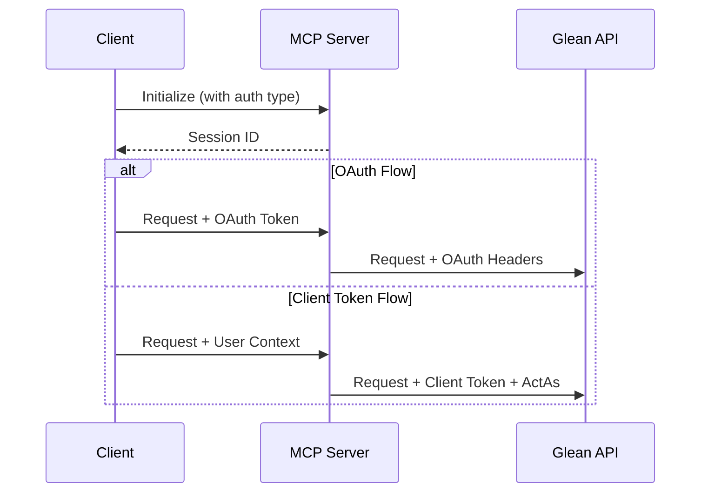

# Authentication Plan for Enhanced Glean MCP Server

## Overview

This document outlines how we're implementing authentication in our enhanced Glean MCP server, aligning with both the MCP protocol requirements and Glean's authentication mechanisms.

## Authentication Flow

### 1. MCP Session Layer
- Each MCP client connection creates a session
- Sessions are identified by `Mcp-Session-Id` header
- Sessions maintain:
  - Connection state
  - User context
  - Authentication state

### 2. Glean Authentication Layer

We support two authentication methods from Glean:

#### OAuth Access Tokens (Primary Method)
- **Purpose**: User-specific access with proper permissions
- **Use Cases**:
  - IDE plugins where user is authenticated
  - Individual developer tools
  - Any client where user context is important
- **Implementation**:
  ```python
  headers = {
      "Authorization": f"Bearer {oauth_token}",
      "X-Glean-Auth-Type": "OAUTH"
  }
  ```

#### Client API Tokens (System/Fallback)
- **Purpose**: System-level or admin operations
- **Use Cases**:
  - System maintenance
  - Multi-user operations
  - Fallback when OAuth is not available
- **Types**:
  1. GLOBAL tokens (with X-Scio-ActAs)
  2. USER tokens (fixed user context)
  3. ANONYMOUS tokens (limited access)

### 3. Authentication Flow in MCP Server



## Implementation Details

### 1. Environment Configuration
```env
# Client API Token Config
GLEAN_API_TOKEN=<token>
GLEAN_SUBDOMAIN=<subdomain>

# OAuth Config
GLEAN_OAUTH_PROVIDER=<provider>
GLEAN_OAUTH_ISSUER=<issuer>
GLEAN_OAUTH_CLIENT_IDS=<client_ids>
```

### 2. Session Management
- Sessions track authentication state
- Support switching between auth methods
- Maintain user context

### 3. Error Handling
- Token validation errors
- Permission issues
- Auth method fallback logic

## Integration with MCP Protocol

### 1. Initialize Request
- Client indicates preferred auth method
- Server validates auth configuration
- Session created with auth context

### 2. Message Flow
- Each message includes session ID
- Auth headers added automatically
- User context maintained per session

## Security Considerations

1. **Token Storage**
   - No token persistence
   - Secure env var handling
   - Memory-only session state

2. **Permission Scoping**
   - Respect OAuth token permissions
   - Proper user context isolation
   - Audit logging of auth changes

3. **Session Security**
   - Secure session ID generation
   - Session timeout handling
   - Proper cleanup

## Testing Strategy

1. **Unit Tests**
   - Auth header generation
   - Token validation
   - Session management

2. **Integration Tests**
   - OAuth flow
   - Client token flow
   - Auth method switching

3. **Security Tests**
   - Session isolation
   - Token handling
   - Permission boundaries

## Deployment Considerations

1. **Configuration**
   - Secure token injection
   - OAuth provider setup
   - Environment validation

2. **Monitoring**
   - Auth failure metrics
   - Session statistics
   - Token usage tracking

3. **Operations**
   - Token rotation procedures
   - Session cleanup
   - Audit logging 