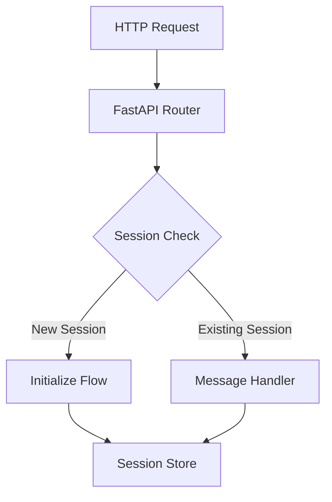

# HTTP Server Implementation Plan

## Overview

This document details how we implement the MCP protocol over HTTP transport while supporting Glean's authentication requirements.

## Server Architecture

### 1. Transport Layer (FastAPI)


### 2. Endpoint Structure

#### Main MCP Endpoint (`/v1/mcp`)
- **POST**: Send MCP messages
  - Handles initialization
  - Processes regular messages
  - Returns immediate responses
- **GET**: Server-sent events (SSE)
  - Long-lived connection
  - Receives server messages
  - Maintains session

#### Health Check (`/health`)
- Basic server health status
- No authentication required
- Used for load balancers

### 3. Session Management

#### Session Creation
```python
class Session:
    id: str                    # Unique session identifier
    auth_type: AuthType        # OAUTH or CLIENT_TOKEN
    user_context: str          # User email when using CLIENT_TOKEN
    oauth_token: Optional[str] # OAuth token when using OAUTH
    created_at: datetime      # Session creation timestamp
```

#### Session Headers
- `Mcp-Session-Id`: Required for all requests after initialization
- `Authorization`: OAuth token or Client token
- `X-Glean-Auth-Type`: Set to "OAUTH" when using OAuth
- `X-Scio-ActAs`: User context for CLIENT_TOKEN auth

### 4. Message Flow

#### Initialize Request
```json
{
  "jsonrpc": "2.0",
  "id": "1",
  "method": "initialize",
  "params": {
    "protocolVersion": "2025-03-26",
    "capabilities": {
      "auth": {
        "type": "oauth",
        "token": "user_oauth_token"
      }
    }
  }
}
```

#### Regular Messages
```json
{
  "jsonrpc": "2.0",
  "id": "2",
  "method": "some_method",
  "params": {
    "_meta": {
      "auth": {
        "type": "oauth",
        "token": "updated_token"
      }
    }
  }
}
```

## Implementation Details

### 1. FastAPI Routes
```python
@app.post("/v1/mcp")
async def mcp_endpoint(
    request: Request,
    accept: str = Header(...),
    mcp_session_id: Optional[str] = Header(None)
) -> Response
```

### 2. Session Store
```python
class SessionManager:
    sessions: Dict[str, Session]
    
    async def create_session(self, auth_type: AuthType) -> Session
    def get_session(self, session_id: str) -> Optional[Session]
    def cleanup_expired_sessions(self)
```

### 3. Message Processing
```python
async def process_mcp_message(
    session: Session,
    message: MCPMessage
) -> Dict:
    # Add auth headers based on session
    headers = auth.get_headers(
        auth_type=session.auth_type,
        access_token=session.oauth_token,
        act_as_user=session.user_context
    )
    # Process message...
```

## Error Handling

### 1. HTTP Status Codes
- 200: Successful message processing
- 400: Invalid message format
- 401: Authentication required
- 403: Permission denied
- 404: Invalid session
- 429: Too many requests

### 2. JSON-RPC Errors
```json
{
  "jsonrpc": "2.0",
  "id": "request_id",
  "error": {
    "code": -32000,
    "message": "Error description"
  }
}
```

## Testing Strategy

### 1. Unit Tests
- Session management
- Message processing
- Auth header generation

### 2. Integration Tests
- Full message flow
- Authentication flows
- SSE streaming

### 3. Load Tests
- Concurrent sessions
- Message throughput
- Session cleanup

## Deployment

### 1. Configuration
```env
# Server Config
HTTP_PORT=8080
WEBSOCKET_PORT=8081

# Session Config
SESSION_TIMEOUT_MINUTES=60
MAX_SESSIONS=1000

# Auth Config
GLEAN_API_TOKEN=xxx
GLEAN_SUBDOMAIN=xxx
```

### 2. Monitoring
- Active sessions count
- Message latency
- Auth failure rates
- Session cleanup metrics

### 3. Security
- Rate limiting
- Session timeout
- Token validation
- Request logging 